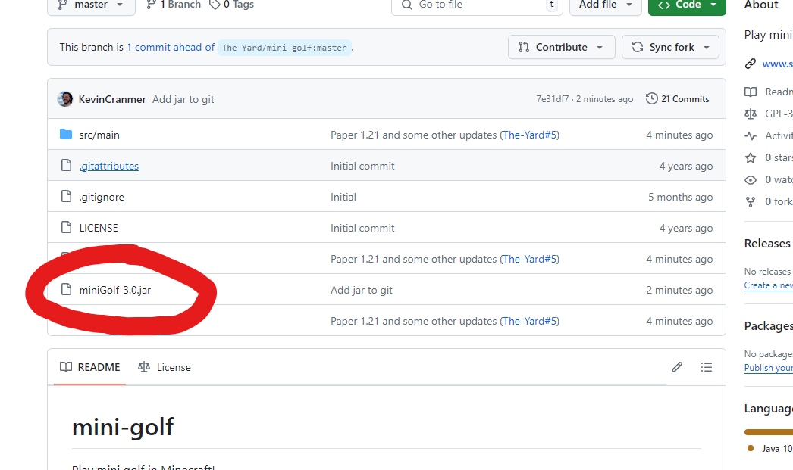
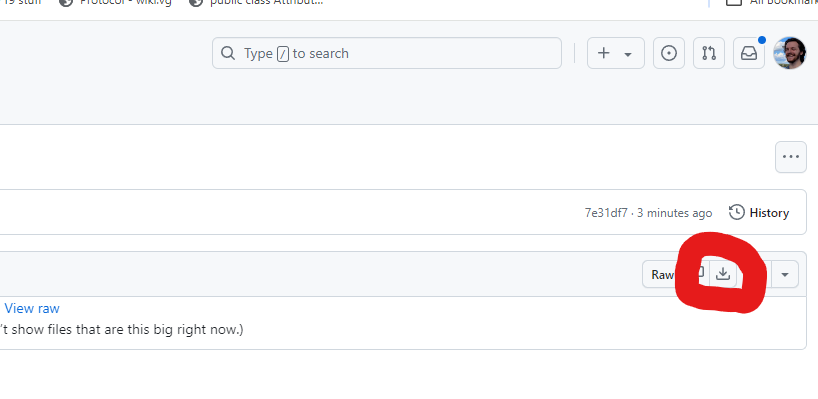

# Mini-Golf
Play mini golf in Minecraft!

## How to Download:

Click on the jar file:



Click the download button:



## Commands

#### /mgcreatecourse <course_name>

Creates a course with the provided name. The course can then be edited with [/mgedit](#/mgedit).

#### /mgdelete <course_name>

Delete a course.

#### /mgedit <course_name|action>

The `mgedit` command is pretty in-depth. The first time you run it, you declare which course you would like to edit.
The next time you run `mgedit` the following actions will be available for you:

| Command                                                                         | Description                                                                                                                                                                      |
|---------------------------------------------------------------------------------|----------------------------------------------------------------------------------------------------------------------------------------------------------------------------------|
| `/mgedit addhole <hole_#>`                                                      | Create a hole at the provided number                                                                                                                                             |
| `/mgedit setstartingballlocation <hole_#> (centered)`                           | When the hole is played, the golf ball will spawn at the location you ran this command from.                                                                                     |
| `/mgedit setstartinglocation <hole_#>`                                          | When the hole is played, the player will be teleported to the location you ran this command from.                                                                                |
| `/mgedit setholelocation <hole_#>`                                              | Where the hole is for this hole. Must have a cauldron beneath you. Cauldron == hole.                                                                                             |
| `/mgedit setpar <hole_#> <par>`                                                 | Set the par for the hole.                                                                                                                                                        |
| `/mgedit setcoursecompletionlocation`                                           | Set the location a player is teleported to once they complete the course.                                                                                                        |
| `/mgedit removehole <hole_#>`                                                   | Delete a hole.                                                                                                                                                                   |
| `/mgedit doneediting`                                                           | Finish editing the current course you're working on.                                                                                                                             |
| `/mgedit createteleporter <entry_loc> <exit_loc> <hole_#>`                      | Creates Obsidian teleporters for the provided hole.                                                                                                                              |
| `/mgedit editteleporter <exit_loc> <entry_direction> <exit_direction> <hole_#>` | Define a new rule for the teleporter. Now if a ball enters the starting teleporter from `<entry_direction>`, it'll exit from the end teleporter going in the `<exit_direction>`. |

#### /mgreload

Reload Configurations.

#### /mgplay <course_name> (<player_name>)

Have `<player_name>` start a game of mini-golf on the `<course_name>` course. If `<player_name>` is omitted, the command sender is assumed.


## Configurations

The 3 different clubs each have extreme customizability.

There are 3 different ways to hit a ball:
- While sneaking
- While standing
- Critical Hit (While falling)

Furthermore, I've taken the distance the player is from the ball as a factor as well. The further the player is from the ball,
the closer to `max` power they will be. A clubs `y` power is also configurable in the same way. Here is the default wedge configuration:

```
  wedge:
    min_power_sneaking: 0.05
    min_y_power_sneaking: 0.1
    max_power_sneaking: 0.1667
    max_y_power_sneaking: 0.2
    min_power_standing: 0.1667
    min_y_power_standing: 0.1
    max_power_standing: 0.3
    max_y_power_standing: 0.2
    min_power_crit: 0.3
    min_y_power_crit: 0.15
    max_power_crit: 0.45
    max_y_power_crit: 0.2
```

The other configurations have comments explaining what they all mean.

## Contact Me

I'm quick to respond most of the time and love hearing about my hard work getting some use. So please hit me up!
https://discord.gg/s4F8VEHegN
